## AWS CI/CD CodePipeline for cross account deployment
Switch smoothly between CodeDeploy deployment group compute platform:
- ECS fargate launch type Blue/Green
- ECS EC2 launch type Blue/Green
- ASG
- EC2 instance

## Architecture
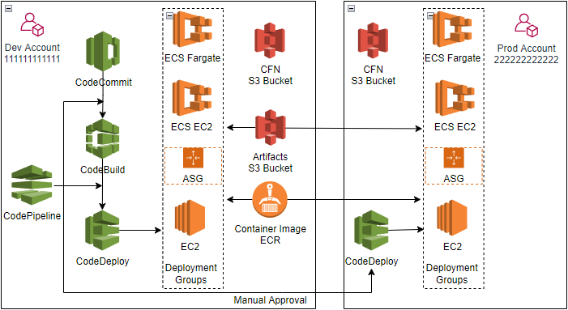

## Prerequisites
Two AWS accounts, each has a IAM user
- Dev account ID: 111111111111  
  The IAM user has AdministratorAccess policy, Access key & Secret access key, and HTTPS Git credentials for CodeCommit
- Prod account ID: 222222222222  
  The IAM user has AdministratorAccess policy, Access key & Secret access key

## Installation Instructions
- [1. ECS fargate Blue/Green deployment group](#ecs-fargate-deployment-group)
- [2. ECS EC2 Blue/Green deployment group](#ecs-ec2-deployment-group)
- [3. ASG deployment group](#asg-deployment-group)
- [4. EC2 deployment group](#ec2-instance-deployment-group)

### <a name="ecs-fargate-deployment-group"></a> 1. Create ECS fargate launch type Blue/Green deployment group, and CI/CD CodePipeline
#### 1.1 Launch EC2 instance as config host in both _`Dev&Prod`_ accounts, clone github repository respectively
```
    git clone https://github.com/dragonflly/pipeline-cicd.git
```
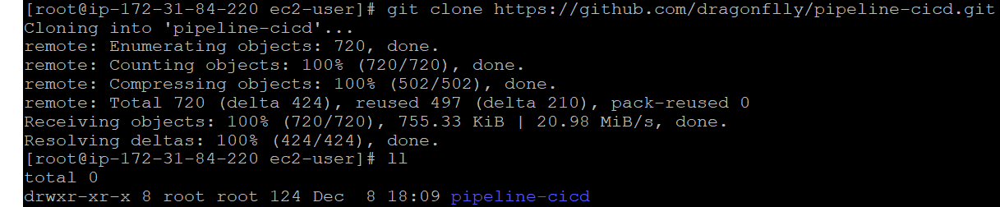

&nbsp; &nbsp; Repository folder tree:
```
  └── pipeline-cicd
      ├── application
      │   ├── ec2-asg-httpd
      │   ├── ecs-ec2-httpd
      │   └── ecs-fargate-httpd
      ├── cfn-template
      ├── CLI-json
      ├── iam-resource
      ├── images
      └── README.md
```

#### 1.2 Create CFN template S3 Bucket in _`Dev&Prod`_ accounts, and upload CFN templates
- Create S3 bucket (Example: templates-dev-us-east-1 in us-east-1) in Dev account
```
    aws s3api create-bucket --bucket templates-dev-us-east-1 --region us-east-1
```
&nbsp; &nbsp; &nbsp; Upload folder pipeline-cicd to bucket templates-dev-us-east-1
```
    aws s3 cp pipeline-cicd s3://templates-dev-us-east-1/pipeline-cicd --recursive
```

- Create S3 bucket (Example: templates-prod-us-east-1 in us-east-1) in Prod account
```
    aws s3api create-bucket --bucket templates-prod-us-east-1 --region us-east-1
```
&nbsp; &nbsp; &nbsp; Upload folder pipeline-cicd to bucket templates-prod-us-east-1
```
    aws s3 cp pipeline-cicd s3://templates-prod-us-east-1/pipeline-cicd --recursive
```

#### 1.3 Create ECR repository, and push docker image to the ECR repository in _`Dev account`_
- Create ECR repository (Example: apache-server-repo in us-east-1)
```
    aws ecr create-repository --repository-name apache-server-repo --region us-east-1
```

- Change directory to pipeline-cicd/application/ecs-fargate-httpd, build docker image
```
    cd pipeline-cicd/application/ecs-fargate-httpd
    docker build -t apache-server-repo .
```

- Tag new docker image
```
    docker tag apache-server-repo:latest 111111111111.dkr.ecr.us-east-1.amazonaws.com/apache-server-repo:latest
```

- Login ECR
```
    aws ecr get-login-password --region us-east-1 | docker login --username AWS --password-stdin 111111111111.dkr.ecr.us-east-1.amazonaws.com
```

- Push new docker image into ECR repository
```
    docker push 111111111111.dkr.ecr.us-east-1.amazonaws.com/apache-server-repo:latest
```
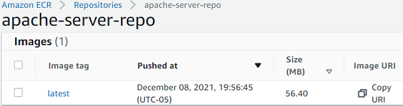

- Edit ECR repository apache-server-repo policy from console, allow Prod account pull the latest created docker image
```
    {
      "Version": "2008-10-17",
      "Statement": [
        {
          "Effect": "Allow",
          "Principal": {
            "AWS": "arn:aws:iam::222222222222:root"
          },
          "Action": [
            "ecr:GetDownloadUrlForLayer",
            "ecr:BatchGetImage"
          ]
        }
      ]
    }
```
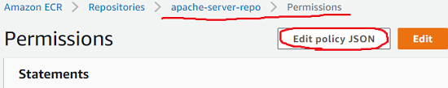

#### 1.4 Create ECS fargate launch type Blue/Green deployment group in _`Prod account`_
- Create stack from AWS CloudFormation console, specify template source by Amazon S3 URL
```
    https://templates-prod-us-east-1.s3.amazonaws.com/pipeline-cicd/cfn-template/cicd-CodeDeploy-ECS-Fargate.yaml
```

- Specify stack input parameter from console
```
    Stack name: fargate-Prod
    ContainerImageUri: 111111111111.dkr.ecr.us-east-1.amazonaws.com/apache-server-repo:latest
    TemplateS3BucketURL: templates-prod-us-east-1.s3.us-east-1.amazonaws.com
    DevAccountID: 111111111111
    ArtifactsS3BucketURL: artifacts-cicd-us-east-1.s3.us-east-1.amazonaws.com
```
&nbsp; &nbsp; &nbsp; It will take about 10 mintues to create stack, then CodeDeploy Application, ECS Cluster, Service, Task, ALB, Listener, Target Group can be viewed from console.

- Change directory to pipeline-cicd/CLI-json, edit deployment_group_prod.json
```
    cd pipeline-cicd/CLI-json
    vi deployment_group_prod.json
```
&nbsp; &nbsp; &nbsp; Update Prod account ID of CodeDeployECSBlueGreenRole, update ARN of ALB listeners
```
    arn:aws:iam::222222222222:role/CodeDeployECSBlueGreenRole
    arn:aws:elasticloadbalancing:us-east-1:222222222222:listener/app/ECSALB/7e9ccf383ca4edaa/8a05a55410e6edba
    arn:aws:elasticloadbalancing:us-east-1:222222222222:listener/app/ECSALB/7e9ccf383ca4edaa/7dd8c6303d2902bf
```
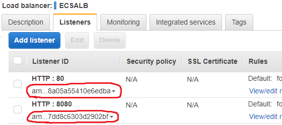

- Create CodeDeploy deployment group by aws deploy CLI
```
    aws deploy create-deployment-group --cli-input-json file://deployment_group_prod.json --region us-east-1
```

#### 1.5 Create ECS fargate launch type Blue/Green deployment group in _`Dev account`_
- Create stack from AWS CloudFormation console, specify template source by Amazon S3 URL
```
    https://templates-dev-us-east-1.s3.amazonaws.com/pipeline-cicd/cfn-template/cicd-CodeDeploy-ECS-Fargate.yaml
```

- Specify stack input parameter from console
```
    Stack name: fargate-Dev
    CodeDeployGroup: CICD-Deployment-Group-Dev
    ContainerImageUri: 111111111111.dkr.ecr.us-east-1.amazonaws.com/apache-server-repo:latest
    TemplateS3BucketURL: templates-dev-us-east-1.s3.us-east-1.amazonaws.com
    DevAccountID: 111111111111
    ArtifactsS3BucketURL: artifacts-cicd-us-east-1.s3.us-east-1.amazonaws.com
```

- Change directory to pipeline-cicd/CLI-json, edit deployment_group_dev.json
```
    cd pipeline-cicd/CLI-json
    vi deployment_group_dev.json
```
&nbsp; &nbsp; &nbsp; Update Dev account ID of CodeDeployECSBlueGreenRole, update ARN of ALB listeners
```
    arn:aws:iam::111111111111:role/CodeDeployECSBlueGreenRole
    arn:aws:elasticloadbalancing:us-east-1:111111111111:listener/app/ECSALB/6adf8751627af34b/782f4f39a3847583
    arn:aws:elasticloadbalancing:us-east-1:111111111111:listener/app/ECSALB/6adf8751627af34b/78b37d991f510c3d
```

- Create CodeDeploy deployment group by aws deploy CLI
```
    aws deploy create-deployment-group --cli-input-json file://deployment_group_dev.json --region us-east-1
```

#### 1.6 Create CICD pipeline in _`Dev account`_
- Create stack from AWS CloudFormation console, specify template source by Amazon S3 URL
```
    https://templates-dev-us-east-1.s3.amazonaws.com/pipeline-cicd/cfn-template/cicd-CodePipeline-dev-account.yaml
```

- Specify stack input parameter from console
```
    Stack name: cicd-pipeline
    TemplateS3Bucket: templates-dev-us-east-1
    ProdAccountID: 222222222222
    ArtifactsS3Bucket: artifacts-cicd-us-east-1
```
&nbsp; &nbsp; &nbsp; It will take about 10 mintues to create stack, then CodePipeline is in failed status, because CodeCommit repository is empty.  

#### 1.7 Push application to CodeCommit repository, to trigger deploy to _`Dev account`_
- Copy URL of CodeCommit repository CICDWebAppRepo, clone repository in Dev account
```
    git clone https://git-codecommit.us-east-1.amazonaws.com/v1/repos/CICDWebAppRepo
```
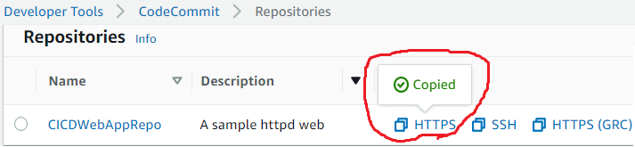

&nbsp; &nbsp; &nbsp; There should be one github repository and one CodeCommit respository in Dev account config  host  


- Update Dev account ID in appspec.yaml & buildspec.yaml under ecs-fargate-httpd folder
```
    cd pipeline-cicd/application/ecs-fargate-httpd
    vi appspec.yaml
    vi buildspec.yaml
```

- If you get "ERROR: toomanyrequests: Too Many Requests" from docker hub, edit Dockerfile, change _`httpd:2.4`_ to _`111111111111.dkr.ecr.us-east-1.amazonaws.com/apache-server-repo:latest`_ (Optional)
```
    cd pipeline-cicd/application/ecs-fargate-httpd
    vi Dockerfile
```

- Update Prod account ID in appspec.yaml under ecs-fargate-httpd/prod-account folder
```
    cd pipeline-cicd/application/ecs-fargate-httpd/prod-account
    vi appspec.yaml
```

- Copy fargate application into CodeCommit repository folder
```
    cp -r pipeline-cicd/application/ecs-fargate-httpd/* CICDWebAppRepo/
```

- Push application to CodeCommit repository, to trigger CodePipeline
```
    cd CICDWebAppRepo
    git add .
    git commit -m "ECS fargate launch type version"
    git push
```
&nbsp; &nbsp; &nbsp; CICD CodePipeline start to deploy into Dev account now! It will take about 10 mintues to deployment, check the progress from CodePipeline console.

- CodeDeploy deployment configuration in Dev accont is ECSAllAtOnce

- Copy ALB URL into web browser, to check fargate deployment group in Dev account. Web page should be
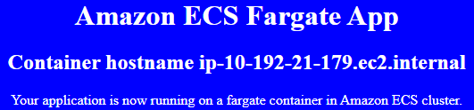

#### 1.8 Manual approval to deploy to _`Prod account`_
- CodeDeploy deployment configuration in Prod accont is ECSLinear10PercentEvery1Minutes  
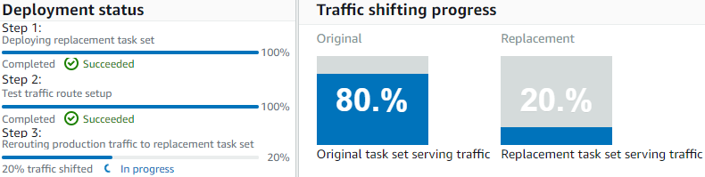

- CodePipeline cross account deployment success  
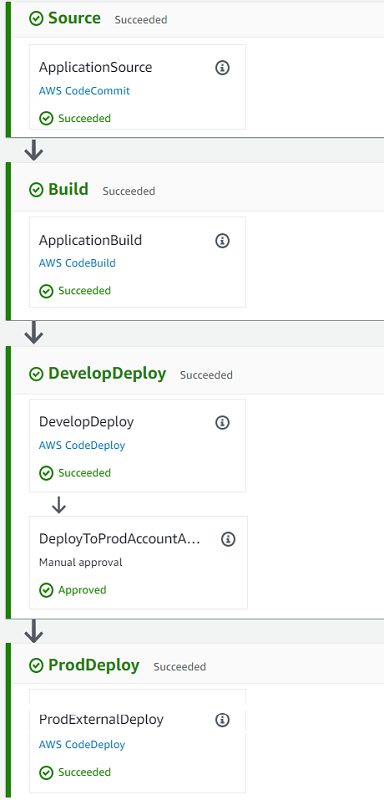

- Copy ALB URL into web browser, to check fargate deployment group in Prod account

#### 1.9 Change background color of web page, trigger cross account deployment again
- In CodeCommit repository CICDWebAppRepo, edit index.html, change _`blue`_ to _`red`_, and commit
- Once deploy complete again, backgroup of web page should be red in both _`Dev&Prod`_ account
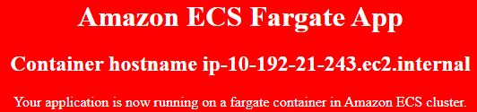

### <a name="ecs-ec2-deployment-group"></a> 2 Switch to ECS EC2 launch type Blue/Green deployment group
#### 2.1 Delete ECS fargate launch type deployment group in _`Dev&Prod`_ accounts
- Delete stack fargate-Dev from CloudFormation console in Dev account
- Delete stack fargate-Prod from CloudFormation console in Prod account   
  Deletion may be failed because of ALB connection draining, delete again later

#### 2.2 Create SSH keyPair in working region (Example: us-east-1)
  - In Dev account
  ```
      aws ec2 create-key-pair --key-name KeyPair-us-east-1-Dev
  ```

  - In Prod account
  ```
      aws ec2 create-key-pair --key-name KeyPair-us-east-1-Prod
  ```

#### 2.3 Create ECS EC2 launch type Blue/Green deployment group in _`Prod account`_
- Share ECR repository with fargate deployment group, so no need create ECR repository anymore
- Create stack from AWS CloudFormation console, specify template source by Amazon S3 URL
```
    https://templates-prod-us-east-1.s3.amazonaws.com/pipeline-cicd/cfn-template/cicd-CodeDeploy-ECS-EC2.yaml
```

- Specify stack input parameter from console
```
    Stack name: ECS-EC2-Prod
    KeyPairName: KeyPair-us-east-1-Prod
    ContainerImageUri: 111111111111.dkr.ecr.us-east-1.amazonaws.com/apache-server-repo:latest
    TemplateS3BucketURL: templates-prod-us-east-1.s3.us-east-1.amazonaws.com
    DevAccountID: 111111111111
    ArtifactsS3BucketURL: artifacts-cicd-us-east-1.s3.us-east-1.amazonaws.com
```

- Change directory to pipeline-cicd/CLI-json, edit deployment_group_prod.json
```
    cd pipeline-cicd/CLI-json
    vi deployment_group_prod.json
```
&nbsp; &nbsp; &nbsp; Update Prod account ID of CodeDeployECSBlueGreenRole, update ARN of ALB listeners
```
    arn:aws:iam::222222222222:role/CodeDeployECSBlueGreenRole
    arn:aws:elasticloadbalancing:us-east-1:222222222222:listener/app/ECSALB/7e9ccf383ca4edaa/8a05a55410e6edba
    arn:aws:elasticloadbalancing:us-east-1:222222222222:listener/app/ECSALB/7e9ccf383ca4edaa/7dd8c6303d2902bf
```

- Create CodeDeploy deployment group by aws deploy CLI
```
    aws deploy create-deployment-group --cli-input-json file://deployment_group_prod.json --region us-east-1
```

#### 2.4 Create ECS EC2 launch type Blue/Green deployment group in _`Dev account`_
- Create stack from AWS CloudFormation console, specify template source by Amazon S3 URL
```
    https://templates-dev-us-east-1.s3.amazonaws.com/pipeline-cicd/cfn-template/cicd-CodeDeploy-ECS-EC2.yaml
```

- Specify stack input parameter from console
```
    Stack name: ECS-EC2-Dev
    CodeDeployGroup: CICD-Deployment-Group-Dev
    KeyPairName: KeyPair-us-east-1-Dev
    ContainerImageUri: 111111111111.dkr.ecr.us-east-1.amazonaws.com/apache-server-repo:latest
    TemplateS3BucketURL: templates-dev-us-east-1.s3.us-east-1.amazonaws.com
    DevAccountID: 111111111111
    ArtifactsS3BucketURL: artifacts-cicd-us-east-1.s3.us-east-1.amazonaws.com
```

- Change directory to pipeline-cicd/CLI-json, edit deployment_group_dev.json
```
    cd pipeline-cicd/CLI-json
    vi deployment_group_dev.json
```
&nbsp; &nbsp; &nbsp; Update Dev account ID of CodeDeployECSBlueGreenRole, update ARN of ALB listeners
```
    arn:aws:iam::111111111111:role/CodeDeployECSBlueGreenRole
    arn:aws:elasticloadbalancing:us-east-1:111111111111:listener/app/ECSALB/6adf8751627af34b/782f4f39a3847583
    arn:aws:elasticloadbalancing:us-east-1:111111111111:listener/app/ECSALB/6adf8751627af34b/78b37d991f510c3d
```

- Create CodeDeploy deployment group by aws deploy CLI
```
    aws deploy create-deployment-group --cli-input-json file://deployment_group_dev.json --region us-east-1
```

#### 2.5 Push application to CodeCommit repository, to trigger deploy to _`Dev account`_
- Update CodeCommit repository CICDWebAppRepo
```
    cd CICDWebAppRepo
    git pull
    rm -fr *
```

- Update Dev account ID in appspec.yaml & buildspec.yaml under ecs-ec2-httpd folder
```
    cd pipeline-cicd/application/ecs-ec2-httpd
    vi appspec.yaml
    vi buildspec.yaml
```

- If you get "ERROR: toomanyrequests: Too Many Requests" from docker hub, edit Dockerfile, change _`httpd:2.4`_ to _`111111111111.dkr.ecr.us-east-1.amazonaws.com/apache-server-repo:latest`_ (Optional)
```
    cd pipeline-cicd/application/ecs-ec2-httpd
    vi Dockerfile
```

- Update Prod account ID in appspec.yaml under ecs-ec2-httpd/prod-account folder
```
    cd pipeline-cicd/application/ecs-ec2-httpd/prod-account
    vi appspec.yaml
```

- Copy ECS EC2 application into CodeCommit repository folder
```
    \cp -r pipeline-cicd/application/ecs-ec2-httpd/* CICDWebAppRepo/
```

- Push application to CodeCommit repository, to trigger CodePipeline
```
    cd CICDWebAppRepo
    git add .
    git commit -m "ECS EC2 launch type version"
    git push
```
&nbsp; &nbsp; &nbsp; It will take about 10 mintues to deploy.

- Copy ALB URL into web browser, to check ECS EC2 deployment group in Prod account
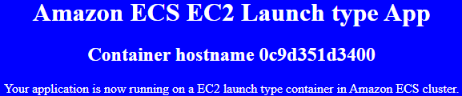

#### 2.6 Manual approval to deploy to _`Prod account`_
- Copy ALB URL into web browser, to check ECS EC2 deployment group in Dev account

### <a name="asg-deployment-group"></a> 3 Switch to ASG deployment group
#### 3.1 Delete ECS EC2 launch type deployment group in _`Dev&Prod`_ accounts
- Delete stack ECS-EC2-Dev from CloudFormation console in Dev account
- Delete stack ECS-EC2-Prod from CloudFormation console in Prod account   

#### 3.2 Create ASG deployment group in _`Prod account`_
- Create stack from AWS CloudFormation console, specify template source by Amazon S3 URL
```
    https://templates-prod-us-east-1.s3.amazonaws.com/pipeline-cicd/cfn-template/cicd-CodeDeploy-ASG.yaml
```

- Specify stack input parameter from console
```
    Stack name: ASG-Prod
    KeyPairName: KeyPair-us-east-1-Prod
    TemplateS3BucketURL: templates-prod-us-east-1.s3.us-east-1.amazonaws.com
    DevAccountID: 111111111111
    ArtifactsS3BucketURL: artifacts-cicd-us-east-1.s3.us-east-1.amazonaws.com
```

#### 3.3 Create ASG deployment group in _`Dev account`_
- Create stack from AWS CloudFormation console, specify template source by Amazon S3 URL
```
    https://templates-dev-us-east-1.s3.amazonaws.com/pipeline-cicd/cfn-template/cicd-CodeDeploy-ASG.yaml
```

- Specify stack input parameter from console
```
    Stack name: ASG-Dev
    CodeDeployGroup: CICD-Deployment-Group-Dev
    KeyPairName: KeyPair-us-east-1-Dev
    TemplateS3BucketURL: templates-dev-us-east-1.s3.us-east-1.amazonaws.com
    DevAccountID: 111111111111
    ArtifactsS3BucketURL: artifacts-cicd-us-east-1.s3.us-east-1.amazonaws.com
```
&nbsp; &nbsp; &nbsp; It will take about 10 mintues to create stack.

#### 3.4 Push application to CodeCommit repository, to trigger deployment to _`Dev account`_
- Update CodeCommit repository CICDWebAppRepo
```
    cd CICDWebAppRepo
    git pull
    rm -fr *
```

- Copy ASG application into CodeCommit repository folder
```
    \cp -r pipeline-cicd/application/ec2-asg-httpd/* CICDWebAppRepo/
```

- Push application to CodeCommit repository, to trigger CodePipeline
```
    cd CICDWebAppRepo
    git add .
    git commit -m "ASG version"
    git push
```
- Copy ALB URL into web browser, to check ASG deployment group in Dev account
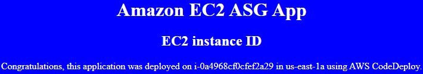

#### 3.5 Manual approval to deploy to _`Prod account`_
- Copy ALB URL into web browser, to check ASG deployment group in Prod account

### <a name="ec2-instance-deployment-group"></a> 4 Switch to EC2 deployment group
#### 4.1 Delete ASG deployment group in _`Dev&Prod`_ accounts
- Delete stack ASG-Dev from CloudFormation console in Dev account
- Delete stack ASG-Prod from CloudFormation console in Prod account   

#### 4.2 Create EC2 deployment group in _`Prod account`_
- Create stack from AWS CloudFormation console, specify template source by Amazon S3 URL
```
    https://templates-prod-us-east-1.s3.amazonaws.com/pipeline-cicd/cfn-template/cicd-CodeDeploy-EC2.yaml
```

- Specify stack input parameter from console
```
    Stack name: EC2-Prod
    KeyPairName: KeyPair-us-east-1-Prod
    TemplateS3BucketURL: templates-prod-us-east-1.s3.us-east-1.amazonaws.com
    DevAccountID: 111111111111
    ArtifactsS3BucketURL: artifacts-cicd-us-east-1.s3.us-east-1.amazonaws.com
```

#### 4.3 Create EC2 deployment group in _`Dev account`_
- Create stack from AWS CloudFormation console, specify template source by Amazon S3 URL
```
    https://templates-dev-us-east-1.s3.amazonaws.com/pipeline-cicd/cfn-template/cicd-CodeDeploy-EC2.yaml
```

- Specify stack input parameter from console
```
    Stack name: EC2-Dev
    CodeDeployGroup: CICD-Deployment-Group-Dev
    KeyPairName: KeyPair-us-east-1-Dev
    TemplateS3BucketURL: templates-dev-us-east-1.s3.us-east-1.amazonaws.com
    DevAccountID: 111111111111
    ArtifactsS3BucketURL: artifacts-cicd-us-east-1.s3.us-east-1.amazonaws.com
```
&nbsp; &nbsp; &nbsp; It will take about 10 mintues to create stack.

#### 4.4 Change background color of web page, trigger cross account deployment again
- In CodeCommit repository CICDWebAppRepo, edit index.html, change _`blue`_ to _`red`_, and commit
- Copy EC2 instance IP into web browser, to check EC2 deployment group in Dev
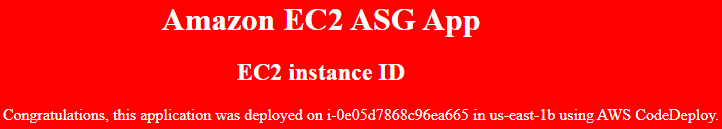

#### 4.5 Manual approval to deploy to _`Prod account`_
- Copy EC2 instance IP into web browser, to check EC2 deployment group in Prod

## License Summary
This code is made available under the MIT license. See the LICENSE file.
